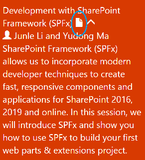

# devday-2018-spfx-demo

这是 Microsoft 2018 Devday 的 SPFx Demo 代码。课程的 PPT 可以在[这里](https://interopevents.com/china2018)下载。

## 如何使用这个 Repo ？

这个代码仓库把每步开发的步骤做成每个 branch。

1. [使用 Yo 模板生成 Web Part 代码](https://github.com/InteropEvents/devday-2018-spfx-demo/tree/1-init)
2. [使用 React 和 SASS 技术实现界面，使用 SharePoint List API 获取数据](https://github.com/InteropEvents/devday-2018-spfx-demo/tree/2-webpart)
3. [使用 Yo 模板生成 Field Customizer Extension 代码](https://github.com/InteropEvents/devday-2018-spfx-demo/tree/3-extension)
4. [实现 Todo 列表的 Completed Field 的个性化代码](https://github.com/InteropEvents/devday-2018-spfx-demo/tree/4-completed-field)
5. [实现 Command Set Extension 来给菜单栏添加自定义功能](https://github.com/InteropEvents/devday-2018-spfx-demo/tree/5-command-set)

我们可以对比每个 branch 来查看每部步骤改动的内容。

- [实现 Web Part 的改动](https://github.com/InteropEvents/devday-2018-spfx-demo/compare/1-init...2-webpart)
- [实现 Field Customizer Extension 的改动](https://github.com/InteropEvents/devday-2018-spfx-demo/compare/3-extension...4-completed-field)

## SharePoint Framework 官方开发文档

SharePoint Framework 的官方开发**中文**文档可以在[这里](https://docs.microsoft.com/zh-cn/sharepoint/dev/spfx/sharepoint-framework-overview)找到。

## 加入 SharePoint 开发使用交流群

